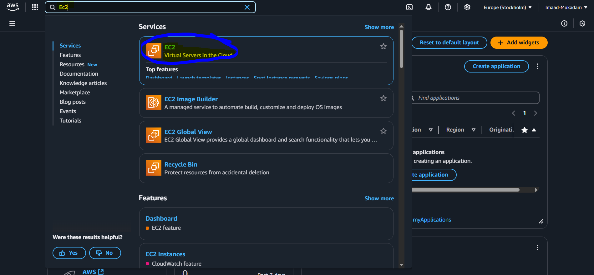
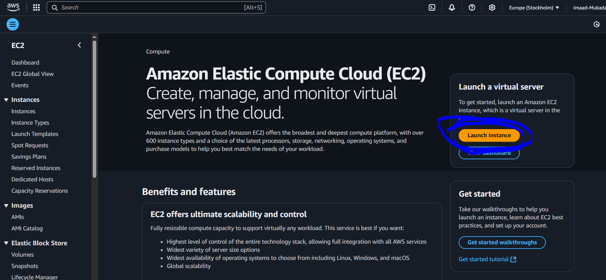
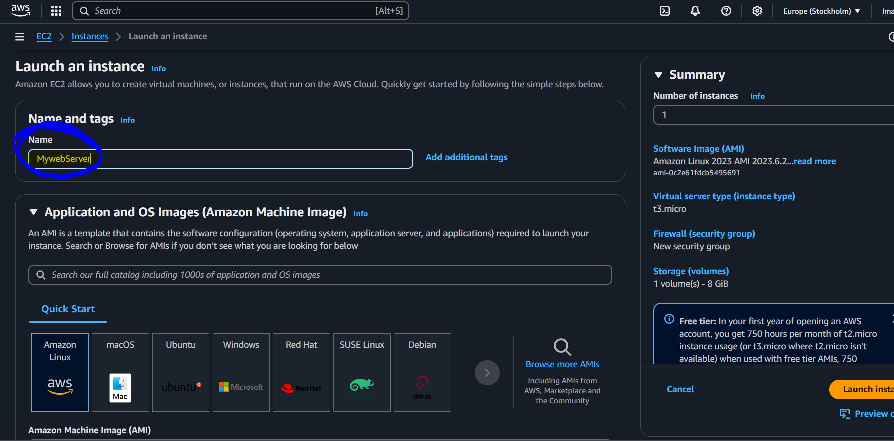
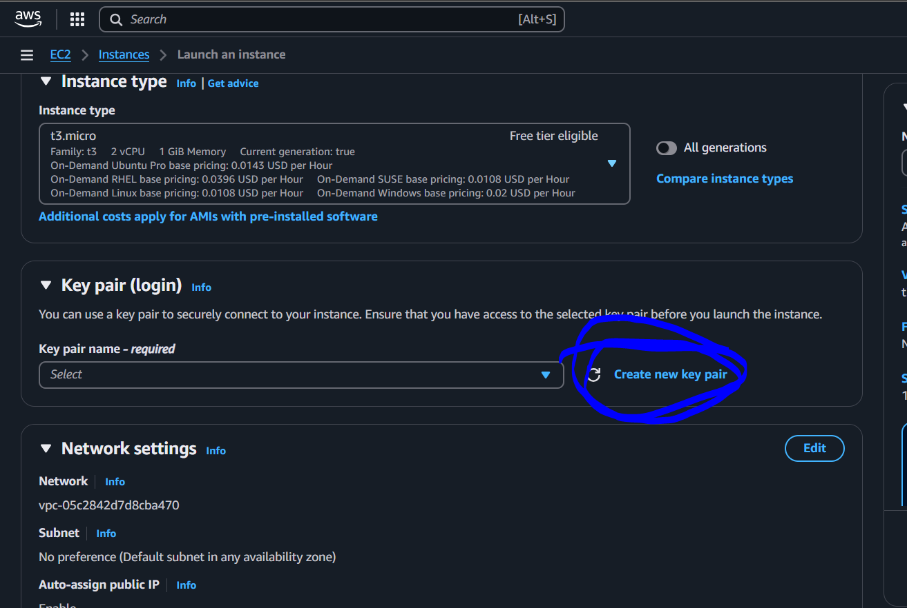
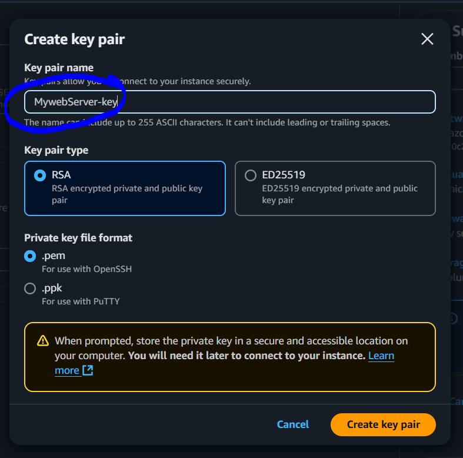
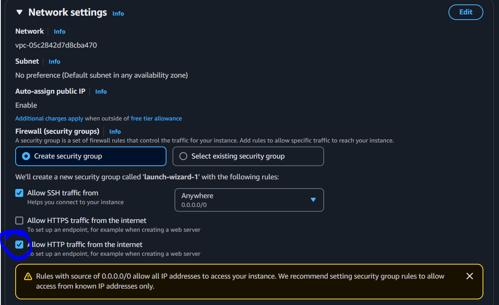
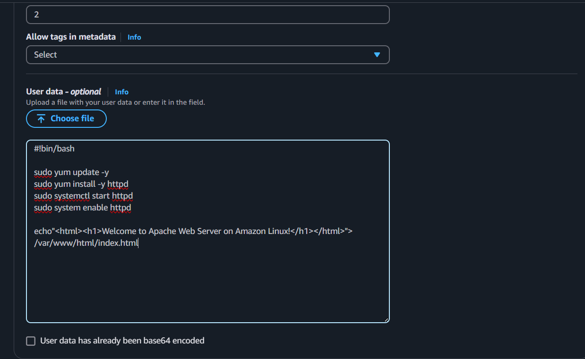
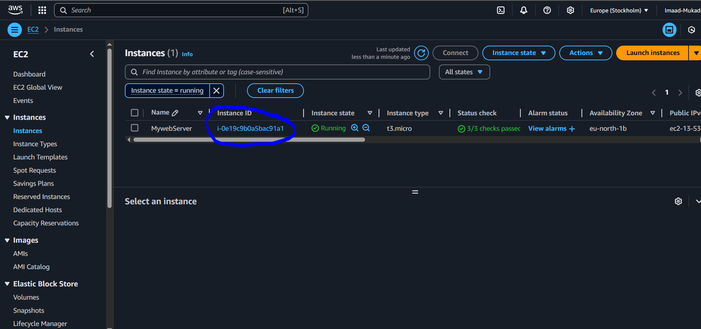
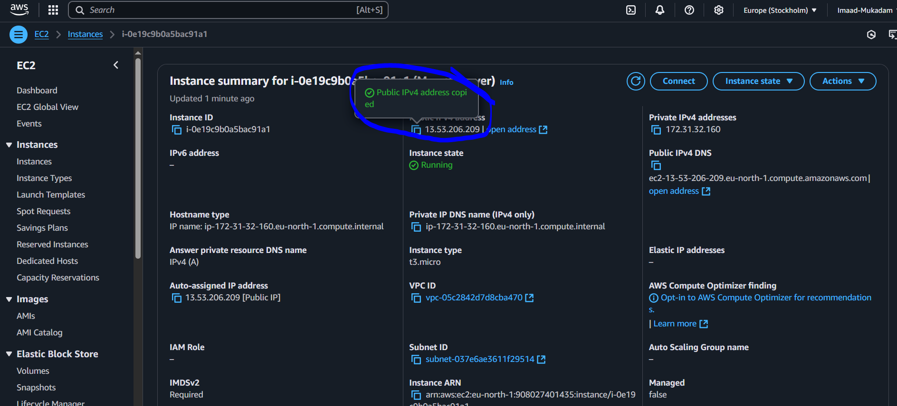

# AWS-EC2-Service-Virtual-Machine

## Summary

### **AWS EC2 Web Server Setup**  

This project automates the deployment of an EC2 instance and configures it as a web server. A script is provided in the **"User Data"** section to install and start a web server, serving a simple `index.html` page.  

#### **Steps:**  
✅ **Launch EC2 Instance** – Create an EC2 instance with a preferred OS (Amazon Linux, Ubuntu, etc.).  
✅ **Attach a Startup Script** – Use the **User Data** section to run a shell script on instance launch.  
✅ **Install Web Server** – The script installs and starts Apache/Nginx.  
✅ **Deploy Web Page** – An `index.html` file is created and served on the instance’s public IP.  

#### **User Data Script (Example for Apache on Amazon Linux 2):**  
```bash
#!/bin/bash
yum update -y
yum install -y httpd
systemctl start httpd
systemctl enable httpd
echo "<h1>Welcome to My EC2 Web Server!</h1>" > /var/www/html/index.html
```

This setup ensures the web server is installed and running as soon as the EC2 instance is created. 🚀  

## Step - 1

i. Search a EC2 Service



ii. Click on Lauch Instance



iii. Give your instance Name , then select your operating System (i'm going with Amazon Linux)



iii. Scroll Down and create a Key pair to access your instance after its completition



iv. Provide your key pair Name



v. Select HTTP so we can host and run over web page 



# Step - 2

i. In Additional Details write this script , to install and create html page , this script will run as your instance is ready



ii. After the script Lauch your instance

## Step - 3

i. Click on Instance id



ii. Now Copy the Public IP and paste it in your brower , you will see your created script running 



